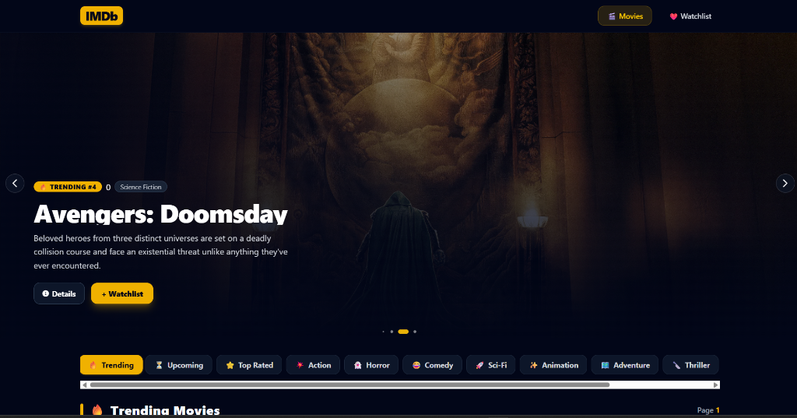

# 🎬 IMDb CinemaHub — Movie Discovery & Watchlist Web App

<div align="center">


**A modern, responsive Cinema & Movie Discovery web application built with React, Vite, and Tailwind CSS.**  
*Powered by TMDB API with dynamic hero carousel, multi-genre exploration, official trailer playback, interactive watchlist, and network-resilient ISP fallback architecture.*

[Live Demo](https://ritikvarun.github.io/IMDB) • [Features](#-key-features) • [Tech Stack](#-tech-stack) • [Installation](#-getting-started)

<br/>



</div>

---

## 🌟 Key Features

### 1. 🎞️ Dynamic Hero Carousel (Featured Movies)
- **Daily Trending Highlights**: Auto-plays featured blockbusters with high-resolution cinematic backdrops.
- **Rich Meta Display**: Live IMDb ratings (`⭐ 8.4/10`), movie overview, genre tags, and quick-action buttons (`Details` & `+ Watchlist`).
- **Touch-Friendly Controls**: Powered by Swiper.js with smooth fade effects, dynamic bullets, and touch-drag support.

### 2. 🎭 Multi-Genre & Category Discovery
- **Instant Genre Switching**: Browse movies effortlessly across 12+ categories:
  - 🔥 **Trending** • ⏳ **Upcoming** • ⭐ **Top Rated**
  - 💥 **Action** • 👻 **Horror** • 😂 **Comedy** • 🚀 **Sci-Fi**
  - ✨ **Animation** • 🗺️ **Adventure** • 🔪 **Thriller** • ❤️ **Romance** • 🎭 **Drama**
- **Independent Pagination**: Seamless multi-page browsing (`Page 1, 2, 3...`) with smooth scroll-to-top transition.

### 3. 🎬 Dedicated Movie Details Page (`/movie/:id`)
- **Immersive Backdrop Hero**: Full-width backdrop header with movie poster, title, release date, runtime, original language, and vote count.
- **🎥 Official YouTube HD Trailer Player**: Embedded 16:9 YouTube video player + instant popup **"Watch Trailer"** modal.
- **📸 4-6 High-Res Photos Gallery**: Interactive image gallery with **Fullscreen Lightbox Modal**.
- **🎭 Top Cast & Characters**: Actor profile photos, real names, and character roles.

### 4. ❤️ Interactive Watchlist Management
- **Persistent Storage**: Real-time sync with browser `LocalStorage`.
- **Live Search & Filter**: Search movies in real time by title and filter by genre chips.
- **Dual View Layout**:
  - 📱 **Mobile View**: Clean, compact movie cards with quick-delete action.
  - 💻 **Desktop View**: Rich tabular view with **Ascending/Descending Rating Sorting** and popularity stats.

### 5. 🛡️ ISP-Resilient Fallback & Proxy System
- Solves Indian ISP DNS throttling (Jio / Airtel / BSNL) for TMDB APIs through a multi-tier fallback architecture:
  1. **Direct TMDB API** (with fast timeout abort)
  2. **CORS / Cloud Proxy Fallback**
  3. **Curated Offline Fallback Dataset** (ensuring 0% downtime)

---

## 🛠️ Tech Stack

| Category | Technology |
|---|---|
| **Frontend Library** | [React.js](https://react.dev/) (v19) |
| **Build Tool** | [Vite](https://vitejs.dev/) (v6) |
| **Styling** | [Tailwind CSS](https://tailwindcss.com/) (v4) |
| **Routing** | [React Router DOM](https://reactrouter.com/) (v7) |
| **HTTP Client** | [Axios](https://axios-http.com/) |
| **Carousel / Slider** | [Swiper.js](https://swiperjs.com/) (v11) |
| **Icons** | [Font Awesome](https://fontawesome.com/) & SVG Icons |
| **Data Provider** | [The Movie Database (TMDB) API](https://www.themoviedb.org/) |

---

## 📁 Project Structure

```bash
IMDB-main/
├── public/                # Static assets & favicon
├── src/
│   ├── assets/            # Project logos & SVGs
│   ├── Components/
│   │   ├── Navbar.jsx         # Sticky glassmorphic navbar with watchlist badge
│   │   ├── SipperBanner.jsx   # Dynamic Swiper carousel banner
│   │   ├── Moive.jsx          # Genre filter tabs, movie grid & pagination
│   │   ├── MoivesCard.jsx     # Modern movie poster card with rating & watchlist heart
│   │   ├── MovieDetail.jsx    # Full movie details, trailer player, gallery & cast
│   │   ├── WishList.jsx       # Watchlist page with search, genre chips & sorting
│   │   └── Pagination.jsx     # Modern pagination controls
│   ├── Utility/
│   │   ├── Genre.js           # TMDB genre mapping dictionary
│   │   └── movieApi.js        # Multi-strategy API fetcher with fallback support
│   ├── App.jsx            # Main app router & global state
│   ├── index.css          # Tailwind CSS & custom sleek scrollbars
│   └── main.jsx           # React DOM root entry point
├── package.json
└── vite.config.js
```

---

## 🚀 Getting Started

### Prerequisites
Make sure you have [Node.js](https://nodejs.org/) installed (v18 or higher recommended).

### 1. Clone the repository
```bash
git clone https://github.com/ritikvarun/IMDB.git
cd IMDB
```

### 2. Install dependencies
```bash
npm install
```

### 3. Start the development server
```bash
npm run dev
```
Open your browser and navigate to `http://localhost:5173`.

### 4. Build for production
```bash
npm run build
```

---

## 📱 Mobile Responsiveness

The entire application is engineered mobile-first:
- **Phone Screens (< 640px)**: 2-column movie grid, touch-friendly carousel banner, horizontal scrollable genre pills, and dedicated mobile watchlist card list.
- **Tablet / Laptop (640px - 1024px)**: 3-4 column responsive grid with medium hero backdrop.
- **Desktop (1024px+)**: 5-6 column grid, high-res carousel banner, and detailed watchlist data table.

---

## 👨‍💻 Author

- **Ritik Varun**
- GitHub: [@ritikvarun](https://github.com/ritikvarun)
- Project Repository: [https://github.com/ritikvarun/IMDB](https://github.com/ritikvarun/IMDB)

---

## 📄 License

This project is open source and available under the [MIT License](LICENSE).
